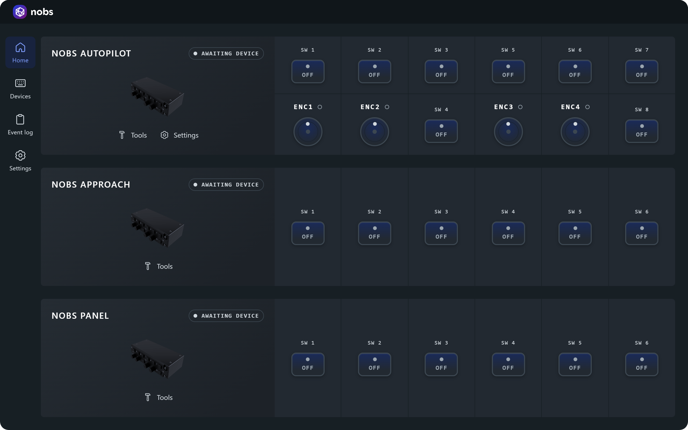
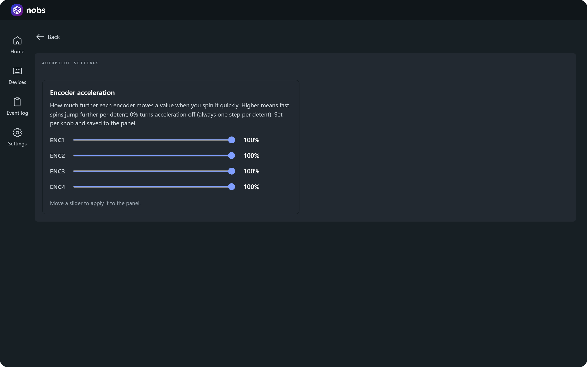

# nobs-fs-app

A desktop/web app that talks to **Nobs FS**, a set of custom flight simulation
hardware panels built on Arduino. Each panel enumerates as a standard USB HID gamepad; this app
reads their raw button reports, turns them into logical controls (encoder turns, push buttons,
toggle switches), and visualizes the live state — no MSFS companion plugin required.

It runs two ways from one codebase:

- **Native desktop** (Tauri + Rust) — auto-detects the panels over HID, zero interaction.
- **Web** (Vite) — runs in any browser for development; uses WebHID on Chromium or the Gamepad
  API as a fallback.

## Download (Windows)

Grab the latest desktop build from the **[Releases page](../../releases/latest)**. Under the
release's **Assets**, pick one installer:

| File | What it is | Pick this if… |
|---|---|---|
| `nobsapp_v<version>_setup.exe` | NSIS setup wizard | **Recommended.** Smaller, runs a quick wizard, creates Start-menu and desktop shortcuts. |
| `nobsapp_v<version>.msi` | Windows Installer package | You deploy via Group Policy / `msiexec`, or prefer the standard MSI format. |

Both install the same app and create shortcuts. The installers are **unsigned**, so on first run
Windows SmartScreen may show "Windows protected your PC" — click **More info → Run anyway**.
WebView2 (the renderer) ships with Windows 11; on older systems the installer pulls it in
automatically.

## What it shows

- **Home** (`/`) — a live mimic of every panel: rotary encoders rendered as knobs, switches as
  push buttons, with per-control press counts and connection status.
- **Events** (`/events`) — a scrolling log of autopilot actions decoded from the HID stream.
- **Tools** (`/tools`) — four horizontal situation indicators (HSIs), one per encoder, driven by
  turning the knobs.
- **Devices** (`/devices`) — connection state of each registered panel.
- **Settings** (`/settings`) — light / dark / system theme.

 

## Hardware

The flagship panel, **Nobs Autopilot**, is an Arduino Micro acting as a USB HID gamepad:

- VID `0x2341`, PID `0x0657`
- 4 Bourns PEC11 rotary encoders (each with a push button)
- 8 ON-ON momentary switches

### HID button mapping

The firmware packs each encoder into 3 consecutive buttons, then the standalone switches:

| Button index | Control |
|---|---|
| `enc*3 + 0` | encoder *enc* clockwise pulse |
| `enc*3 + 1` | encoder *enc* counter-clockwise pulse |
| `enc*3 + 2` | encoder *enc* push button |
| `12 + sw`   | standalone switch *sw* |

So buttons `0–11` are the 4 encoders and `12–19` are switches SW1–SW8. The mapping is the single
source of truth in [`src/panel/panel.ts`](src/panel/panel.ts) (`DEVICES`, `decodeButton`,
`PANEL_LAYOUT`). Two more panels — **Nobs Approach** and **Nobs Panel** — are registered there as
placeholders ahead of the hardware existing.

> MSFS samples a gamepad roughly once per frame, so the firmware holds each encoder pulse for at
> least one frame; the practical ceiling is ~33°/s of knob rotation per registered step.

## Development

Requires [pnpm](https://pnpm.io).

```sh
pnpm install
pnpm dev        # Vite dev server (web)
pnpm tauri dev  # native desktop window with hot reload
pnpm lint       # Biome check
pnpm format     # Biome auto-fix
pnpm build      # type-check + production web build
pnpm screenshots # regenerate the README screenshots (Playwright)
```

### How input is wired

`src/io/selectDriver.ts` picks a `DeviceDriver` at runtime so one bundle works everywhere:

| Environment | Driver | Behavior |
|---|---|---|
| Tauri (native) | `nativeDriver` | Auto-detects panels via the Rust HID bridge — no interaction |
| Chromium browser | `webhidDriver` | Auto-detects after a one-time WebHID permission grant |
| Other browsers | `gamepadDriver` | Fallback; the user must actuate a control before the OS exposes the device |

The driver feeds `useDevice` / `useEventLog` (`src/hooks/`), which expose press detection, counts,
and the decoded event log to the UI.

### Project layout

```
src/
  io/         input drivers (HID report decoding + per-environment backends)
  panel/      hardware definition: device registry, button mapping, panel layout
  hooks/      backend-agnostic device state (useDevice, useEventLog)
  pages/      routed screens (Home, Events, Tools, Devices, Settings, …)
  components/ presentational components (CSS Modules, no UI library)
  theme/      color tokens → CSS custom properties
src-tauri/    native desktop shell (Rust + hidapi)
```

See [`CLAUDE.md`](CLAUDE.md) for the conventions this repo follows (`~/` path alias, barrel
exports, the PanelCard shell / fragment-content composition pattern, theme tokens).

## Desktop builds & releases

Building the Windows executable and installers, the GitHub Actions release workflow, and icon
generation are documented in **[docs/desktop-build.md](docs/desktop-build.md)**.

## License

Copyright (C) 2026 Vegar Eeg.

This project is licensed under the **GNU Affero General Public License v3.0** (AGPL-3.0-only). You
are free to use, modify, and distribute it — including commercially — but if you distribute it or
run a modified version as a network service, you must release your full source under the same
license. See [LICENSE](LICENSE) for the full text.
